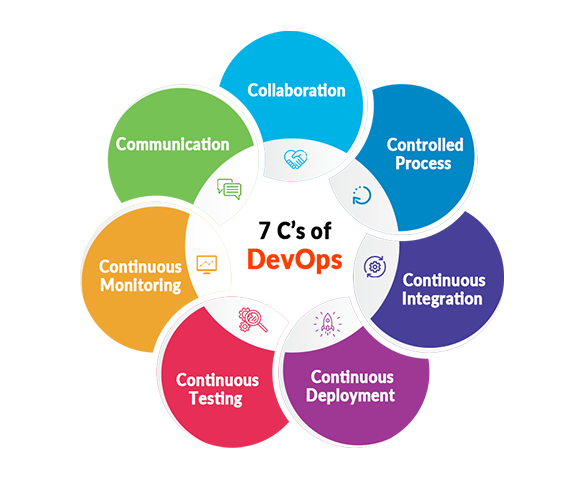

<h1 align="center">DevOps Engineer Learning Path</h1>

  

## Overview

This repository serves as an easy learning path for DevOps engineers, covering essential topics and hands-on exercises.

## Prerequisites

- Linux
  - [1. Linux-Basic Commands](Documents/linux/Linux_1701917941.pdf)
  - [2. Linux-Basic Commands](Documents/linux/Unix_SG_1.pdf)
  - [3. Linux-Basic Commands](Documents/linux/Unix_SG_2.pdf)
  - [4. Linux-Basic Commands](Documents/linux/Unix_SG_3.pdf)

- Python

## AWS Topics

- AWS Account Creation + Intro to AWS
- EC2
- EC2 and EBS
- FSx and EFS
- IAM
- CloudWatch and CloudTrail
- Load Balancing
- Autoscaling
- Route53
- VPC
- S3
- RDS
- CloudFormation and SQS
- SES, SNS, and Lambda
- Elastic Beanstalk and API Gateway
- Global Accelerator and CloudFront
- ENI, ENA, and EFA
- AWS Backup Family

### Hands-on Labs

- [EC2 - Hands-on](assignments/EC2_Hands-on.md)
- [EBS, EFS, ELB - Hands-on](assignments/EBS_EFS_ELB_Hands-on.md)
- [Autoscaling - Hands-on](assignments/Autoscaling_Hands-on.md)
- [VPC - Hands-on](assignments/VPC_Hands-on.md)
- [S3 - Hands-on](assignments/S3_Hands-on.md)
- [IAM - Hands-on](assignments/IAM_Hands-on.md)
- [Lambda - Hands-on](assignments/Lambda_Hands-on.md)

## DevOps Topics

### Introduction to DevOps

- Software Version Control using Git
- Configuration Management using Ansible
- Docker
- Continuous Orchestration using Kubernetes
- Jenkins
- ELK Stack
- Terraform

### Hands-on Labs

- [Git Hands-on](assignments/Git_Hands-on.md)
- [Docker Hands-on](assignments/Docker_Hands-on.md)
- [Kubernetes Hands-on](assignments/Kubernetes_Hands-on.md)
- [Jenkins Hands-on](assignments/Jenkins_Hands-on.md)
- [Ansible Hands-on](assignments/Ansible_Hands-on.md)

### Project Work

- DevOps on AWS
- Project 2: Unlock & Discussion on Project 1
- Mock Interview Preparation

## Virtualization

- Virtualization Overview
- Hands-on Exercises
- Migration Strategies

## Optional Elective Topics

- Course Overview
- Modules
- Pre-Requisites
- Introduction to Cloud Computing
- IaaS, PaaS, SaaS
- Azure DataCenter and Regions
- Understanding Azure Architecture
- Azure Services Overview
- Azure PowerShell and Azure CLI
- Azure Storage and Azure VMs
- Azure Containers and Kubernetes
- Azure Networking (VNET, Load Balancer, Traffic Manager)
- Azure Active Directory (Azure AD)
- Azure DevOps
- Azure Data Factory
- Big Data with Cloud Computing

### Project Timeline Sheet

- [Task Management Sheet](Documents/Project-Management.md)

### CloudOps Sandbox:

- [Module 1: EC2 & EFS ](Documents/CloudOps/Aws/EC2&EFS.pdf)

### Project Playground:

- [SRC 1: Frontend Code Deployment ](Documents/CloudOps/Aws/src/project-1.pdf)
